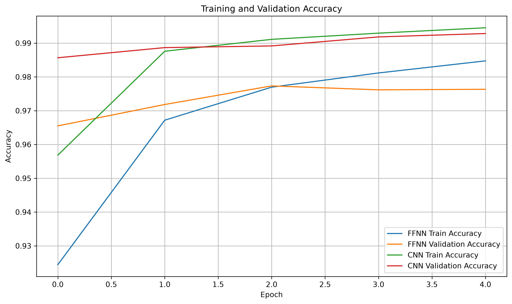
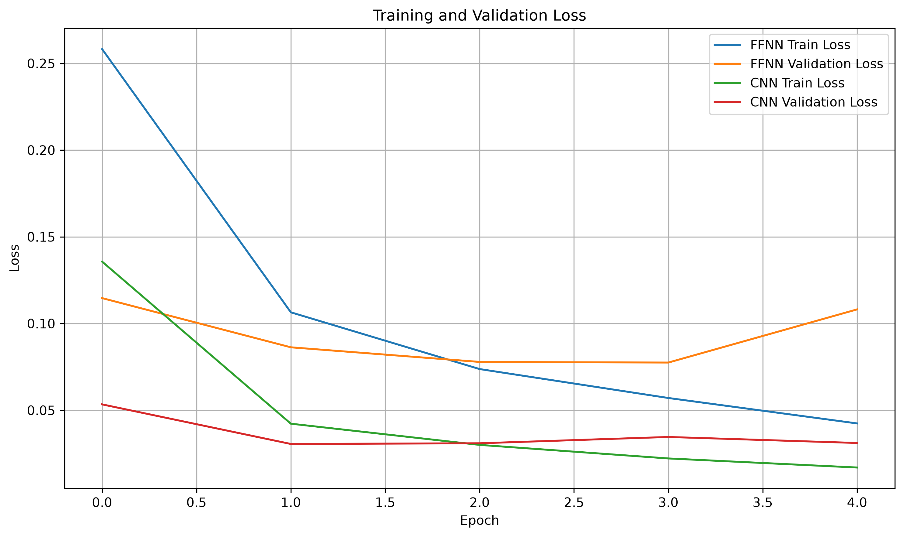
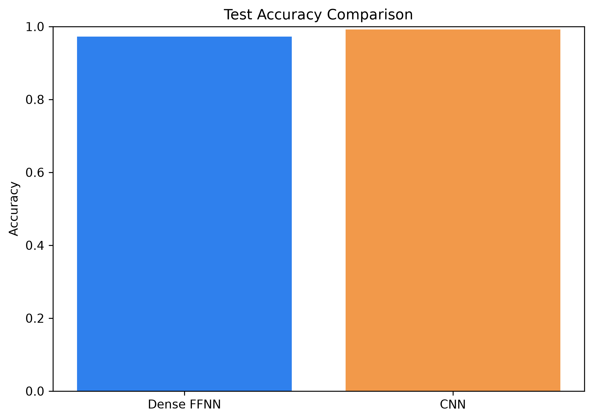
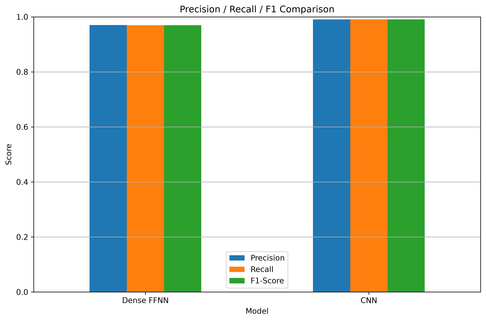
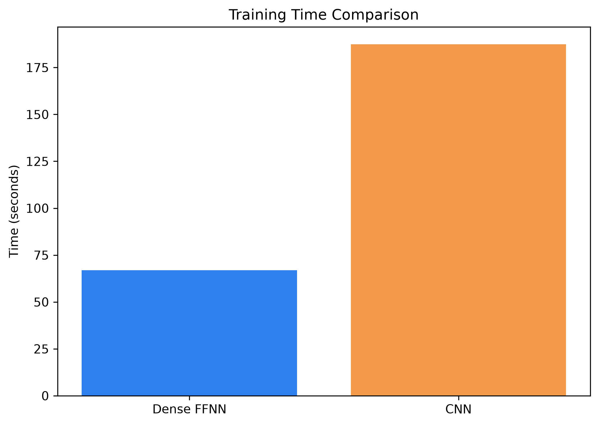
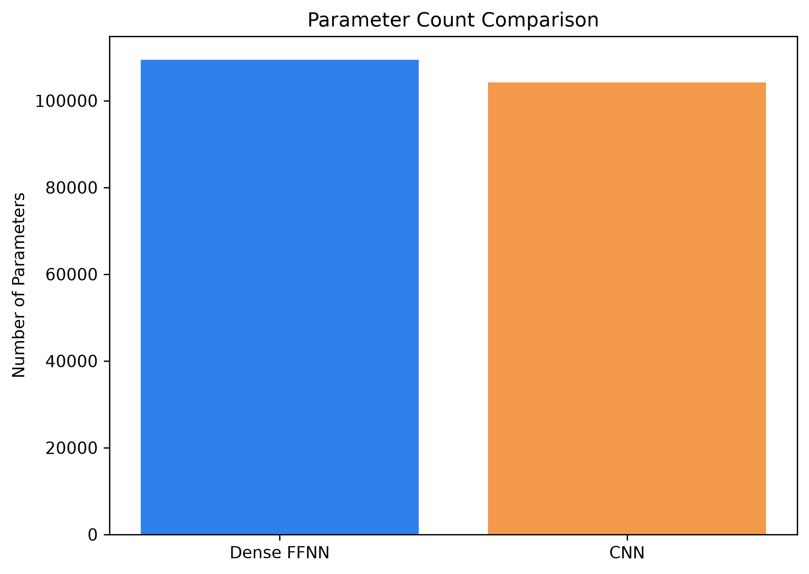
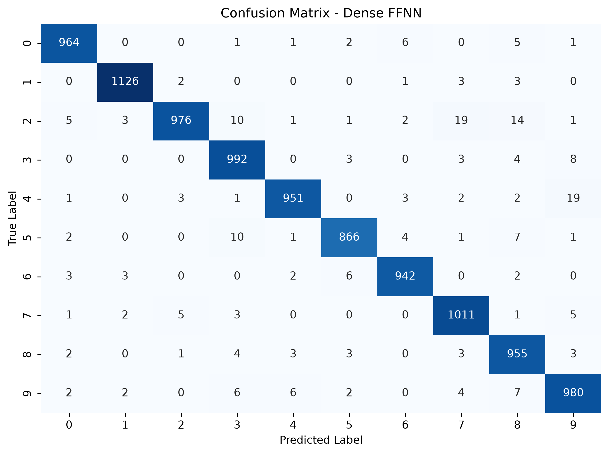
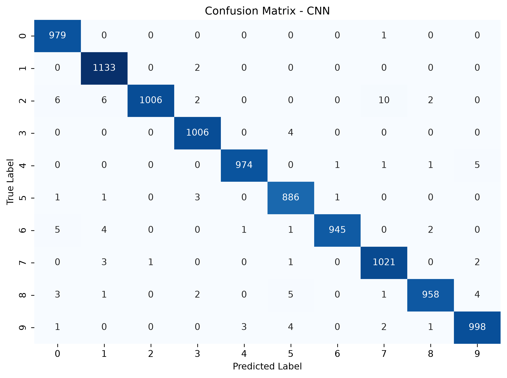
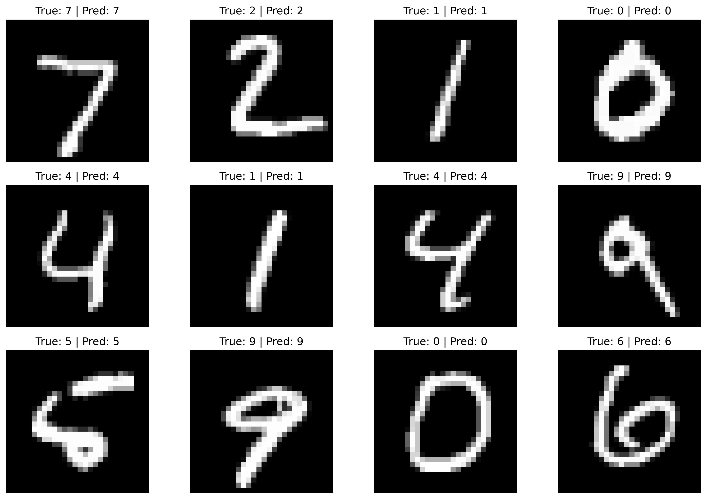

# MNIST: Dense FFNN vs CNN

A Deep Learning project that compares a **Dense Feedforward Neural Network (FFNN)** with a **Convolutional Neural Network (CNN)** for handwritten digit classification using the MNIST dataset.

The project focuses on comparing the two architectures in terms of **test performance, training time, and number of trainable parameters**.

---

## Overview

In this project, two neural network architectures are trained and evaluated on the MNIST handwritten digit dataset:

* **Dense Feedforward Neural Network (FFNN)**
* **Convolutional Neural Network (CNN)**

Both models use the same MNIST training and test data, with the same optimizer, loss function, batch size, number of epochs, and validation strategy.

The main goal is to see how a traditional dense network compares with a CNN when working with image data.

---

## Project Objective

The objectives of this project are to:

* Load and preprocess the MNIST dataset
* Prepare the images for two different neural network architectures
* Build a Dense FFNN for digit classification
* Build a CNN for digit classification
* Train both models using the same general training configuration
* Evaluate both models using multiple classification metrics
* Compare model accuracy, precision, recall, and F1-score
* Compare training time and parameter count
* Visualize training behavior and confusion matrices
* Test the CNN on sample handwritten digit images

---

## Dataset

The project uses the **MNIST dataset** provided through Keras.

The dataset contains grayscale images of handwritten digits from `0` to `9`.

### Dataset Shapes

| Dataset  |            Images |     Labels |
| -------- | ----------------: | ---------: |
| Training | `(60000, 28, 28)` | `(60000,)` |
| Test     | `(10000, 28, 28)` | `(10000,)` |

Each image has a resolution of **28 × 28 pixels**.

The notebook also visualizes sample images before preprocessing.

---

## Data Preprocessing

### Label Encoding

The original integer labels are converted to one-hot encoded vectors using:

```python
keras.utils.to_categorical()
```

This produces a 10-dimensional target vector for the ten digit classes.

### Image Normalization

The images are converted to `float32` and normalized by dividing pixel values by `255.0`.

```python
images = images.astype("float32") / 255.0
```

After normalization, pixel values are in the range:

```text
[0, 1]
```

### Input Preparation

The two models require different input formats.

#### Dense FFNN

The 28 × 28 images are flattened into 784-dimensional vectors:

```text
(60000, 28, 28)
        ↓
(60000, 784)
```

#### CNN

A channel dimension is added to the images:

```text
(60000, 28, 28)
        ↓
(60000, 28, 28, 1)
```

The same transformation is applied to the test images.

---

# Models

## Dense FFNN

The Dense Feedforward Neural Network receives each image as a flattened vector of 784 features.

### Architecture

```text
Input: 784
   ↓
Dense(128, ReLU)
   ↓
Dense(64, ReLU)
   ↓
Dense(10, Softmax)
```

### Layers

| Layer  | Configuration     |
| ------ | ----------------- |
| Input  | 784 features      |
| Dense  | 128 units, ReLU   |
| Dense  | 64 units, ReLU    |
| Output | 10 units, Softmax |

### Parameters

The FFNN contains:

**109,386 trainable parameters**

---

## Convolutional Neural Network

The CNN works directly with the 28 × 28 image structure.

### Architecture

```text
Input: 28 × 28 × 1
        ↓
Conv2D(32, 3×3, ReLU, same)
        ↓
MaxPooling2D(2×2)
        ↓
Conv2D(64, 3×3, ReLU, same)
        ↓
MaxPooling2D(2×2)
        ↓
Conv2D(128, 3×3, ReLU, same)
        ↓
MaxPooling2D(2×2)
        ↓
Flatten
        ↓
Dense(10, Softmax)
```

### Layers

| Layer        | Configuration                          |
| ------------ | -------------------------------------- |
| Conv2D       | 32 filters, 3×3, ReLU, `same` padding  |
| MaxPooling2D | 2×2                                    |
| Conv2D       | 64 filters, 3×3, ReLU, `same` padding  |
| MaxPooling2D | 2×2                                    |
| Conv2D       | 128 filters, 3×3, ReLU, `same` padding |
| MaxPooling2D | 2×2                                    |
| Flatten      | —                                      |
| Dense        | 10 units, Softmax                      |

### Parameters

The CNN contains:

**104,202 trainable parameters**

---

# Model Configuration

Both models use the following configuration:

| Setting          | Value                    |
| ---------------- | ------------------------ |
| Optimizer        | Adam                     |
| Loss Function    | Categorical Crossentropy |
| Metric           | Accuracy                 |
| Epochs           | 5                        |
| Batch Size       | 32                       |
| Validation Split | 10%                      |

Training was performed using:

```python
model.fit(
    ...,
    epochs=5,
    batch_size=32,
    validation_split=0.1
)
```

---

# Model Training

## Dense FFNN Training

The Dense FFNN was trained for **5 epochs** with a batch size of **32**.

Final training results:

* Training Accuracy: **0.9847**
* Training Loss: **0.0460**
* Validation Accuracy: **0.9763**
* Validation Loss: **0.0816**

Training time:

**22.335 seconds**

---

## CNN Training

The CNN was trained using the same number of epochs and batch size.

Final training results:

* Training Accuracy: **0.9945**
* Training Loss: **0.0169**
* Validation Accuracy: **0.9928**
* Validation Loss: **0.0274**

Training time:

**151.762 seconds**

---

# Training Curves

The project compares the training and validation accuracy of both models over the five training epochs.

<p align="center">
  
</p>

The CNN reaches a higher training and validation accuracy during training, while the FFNN reaches a lower final validation accuracy.

The notebook also includes loss curves for both models.

<p align="center">
  
</p>

---

# Evaluation Metrics

After training, both models are evaluated on the MNIST test set.

The following metrics are calculated:

* Accuracy
* Weighted Precision
* Weighted Recall
* Weighted F1-Score

Precision, recall, and F1-score are calculated using:

```python
average="weighted"
```

---

# Results

The final test results obtained from the notebook are:

| Model      |   Accuracy |  Precision |     Recall |   F1-Score | Training Time | Parameters |
| ---------- | ---------: | ---------: | ---------: | ---------: | ------------: | ---------: |
| Dense FFNN |     0.9719 |     0.9721 |     0.9719 |     0.9719 |      22.335 s |    109,386 |
| CNN        | **0.9915** | **0.9915** | **0.9915** | **0.9915** |     151.762 s |    104,202 |

The CNN achieved the higher test accuracy.

### Test Accuracy

The CNN achieved:

**99.15%**

while the Dense FFNN achieved:

**97.19%**

This is a difference of **1.96 percentage points** in favor of the CNN.

<p align="center">
  
</p>

---

## Precision, Recall and F1-Score

The CNN achieved **0.9915** for all three metrics, while the FFNN achieved approximately **0.972**.

<p align="center">
  
</p>

---

## Training Time

The Dense FFNN was considerably faster to train:

* FFNN: **22.335 seconds**
* CNN: **151.762 seconds**

The CNN required approximately **6.8× more training time** in this experiment.

<p align="center">
  
</p>

---

## Parameter Count

Interestingly, the CNN has fewer trainable parameters than the Dense FFNN:

* FFNN: **109,386**
* CNN: **104,202**

The CNN therefore uses **5,184 fewer parameters** in this implementation.

<p align="center">
  
</p>

---

# Confusion Matrices

Confusion matrices are generated for both models to examine their classification results across the ten digit classes.

## Dense FFNN

<p align="center">
  
</p>

## CNN

<p align="center">
  
</p>

The confusion matrices provide a class-by-class view of the predictions and make it possible to see which handwritten digits are more frequently confused.

---

# Sample Predictions

The notebook also visualizes predictions made by the CNN on several test images.

For each sample, the true label and predicted label are displayed.

<p align="center">
  
</p>

The project also includes a prediction example where the CNN predicts the digit:

```text
CNN Predicted Digit: 3
Confidence: 100.00%
```

The prediction is obtained from the model's output probabilities using `argmax`.

---

# Model Comparison

The main comparison can be summarized as follows:

| Aspect        |   Dense FFNN |         CNN |
| ------------- | -----------: | ----------: |
| Test Accuracy |       97.19% |  **99.15%** |
| Precision     |       97.21% |  **99.15%** |
| Recall        |       97.19% |  **99.15%** |
| F1-Score      |       97.19% |  **99.15%** |
| Training Time | **22.335 s** |   151.762 s |
| Parameters    |      109,386 | **104,202** |

The results show a clear trade-off in this experiment:

* **CNN:** better classification performance and fewer parameters
* **FFNN:** significantly faster training time
* **CNN:** better suited to this image classification task based on the obtained test results

---

# Visualizations

The project includes several visualizations generated during the experiment:

* Sample MNIST images
* Training and validation accuracy curves
* Training and validation loss curves
* FFNN confusion matrix
* CNN confusion matrix
* Test accuracy comparison
* Precision, Recall, and F1-score comparison
* Training time comparison
* Parameter count comparison
* CNN sample predictions

The main plots are stored in the `plots/` directory.

---

# Saved Outputs

The notebook saves the trained models and experiment results.

### Training Histories

```text
results/
├── history_ffnn.json
└── history_cnn.json
```

### Trained Models

```text
models/
├── dense_ffnn.keras
└── cnn.keras
```

### Comparison Results

```text
results/
└── comparison_results.csv
```

The CSV file contains the final comparison between the two models, including:

* Test Accuracy
* Precision
* Recall
* F1-Score
* Training Time
* Parameter Count

---

# Project Structure

The project is organized as follows:

```text
MNIST-FFNN-vs-CNN/
│
├── notebook/
│   └── mnist_ffnn_vs_cnn.ipynb
│
├── models/
│   ├── dense_ffnn.keras
│   └── cnn.keras
│
├── results/
│   ├── history_ffnn.json
│   ├── history_cnn.json
│   └── comparison_results.csv
│
├── plots/
│   ├── accuracy_curves.png
│   ├── loss_curves.png
│   ├── test_accuracy_comparison.png
│   ├── metrics_comparison.png
│   ├── training_time_comparison.png
│   ├── parameter_count_comparison.png
│   ├── confusion_matrix_ffnn.png
│   ├── confusion_matrix_cnn.png
│   └── sample_predictions.png
│
└── README.md
```

---

# Technologies

The project uses:

* Python
* Keras
* TensorFlow
* NumPy
* Pandas
* Matplotlib
* Seaborn
* Scikit-learn
* OpenCV

---

# Conclusion

This project compares a Dense Feedforward Neural Network and a Convolutional Neural Network on MNIST.

The **CNN achieved better test performance**, reaching **99.15% test accuracy**, compared with **97.19% for the Dense FFNN**. It also achieved higher Precision, Recall, and F1-Score.

At the same time, the Dense FFNN trained much faster, taking **22.335 seconds**, while the CNN required **151.762 seconds**.

Although the CNN achieved better performance, it is important to consider the training-time difference when comparing the two approaches.

Overall, this experiment demonstrates the practical difference between using a dense architecture with flattened image inputs and a convolutional architecture that works with the spatial structure of image data.

---

## Project Notebook

The complete experiment, including preprocessing, model building, training, evaluation, visualizations, and predictions, is available in the Jupyter Notebook:

```text
notebook/mnist_ffnn_vs_cnn.ipynb
```

---

## Author

**Mahsa Hosseini**

GitHub: `github.com/misshosseini`
